# 🏛️ Legal Aid Navigator

An advanced AI-powered RAG (Retrieval-Augmented Generation) system that helps tenants understand their legal rights and navigate complex housing laws across different jurisdictions. Built with state-of-the-art LLM technology and comprehensive evaluation frameworks.

## 📋 Project Overview

**Problem:** Tenants facing housing issues struggle to understand their legal rights and navigate complex housing laws that vary by location, jurisdiction, and specific circumstances. Legal aid services are often overwhelmed, and online resources are generic and not location-specific.

**Solution:** A sophisticated RAG system with multi-agent reasoning capabilities, advanced retrieval techniques, and comprehensive evaluation metrics to provide accurate, contextual legal guidance.

### Target Audience
- **Renters** facing eviction, repair issues, or rental disputes
- **Legal aid volunteers** assisting tenants with housing cases
- **Tenant union organizers** educating members about their rights

## 🛠️ Tech Stack

| Component | Choice | Justification |
|-----------|---------|---------------|
| **LLM** | GPT-4o | Best reasoning for legal nuance, cost-effective |
| **Embeddings** | text-embedding-3-small | High quality, fast, cheap |
| **Vector DB** | Qdrant (in-memory) | Advanced vector operations, production-ready |
| **Orchestration** | LangChain & LangGraph | Rapid prototyping, excellent agent support |
| **Evaluation** | RAGAS | Industry standard for RAG evaluation |
| **Monitoring** | LangSmith | Free tier, excellent tracing |
| **Search** | Tavily Search API | Real-time web search capabilities |
| **Research** | ArXiv integration | Access to latest legal research |
| **Document Processing** | PyMuPDF, Unstructured | Robust PDF and document processing |

## 🏗️ Project Structure

```
📁 11_certification_challenge/
├── 📄 legal_aid_navigator.ipynb    # Main demo notebook with complete workflow
├── 📄 README.md                    # This comprehensive documentation
├── 📄 pyproject.toml               # Project dependencies and configuration
├── 📄 uv.lock                      # Lock file for reproducible builds
├── 📄 test_pdf_processing.py       # PDF processing test script
├── 📄 test_rag.html               # Interactive RAG testing interface
├── 📄 usecase_data_kg.json        # Knowledge graph data for use cases
├── 📄 rag_chain.joblib            # Saved RAG chain (joblib format)
├── 📄 rag_chain.pkl               # Saved RAG chain (pickle format)
│
├── 📁 src/                         # Source code modules
│   ├── 📄 __init__.py             # Package initialization
│   ├── 📄 data_ingestion.py       # Task 1: Data ingestion pipeline
│   ├── 📄 chunking_strategy.py    # Task 2: Document chunking strategy
│   └── 📄 dynamic_rag.py          # Dynamic RAG implementation
│
├── 📁 data/                        # Data directory
│   ├── 📁 raw/                     # Raw documents (PDFs + JSON)
│   │   ├── 📄 Fair Housing Act Summary.pdf
│   │   ├── 📄 NOLO California Quick Guide.pdf
│   │   ├── 📄 California Tenant Rights Guide.pdf
│   │   ├── 📄 HUD Tenant Rights and Responsibilities.pdf
│   │   ├── 📄 Texas Tenant Handbook.pdf
│   │   ├── 📄 san_francisco_rent_control.json
│   │   ├── 📄 california_civil_code.json
│   │   ├── 📄 fair_housing_act.json
│   │   └── 📄 austin_tenant_rights.json
│   ├── 📁 processed/               # Processed documents
│   ├── 📁 vector_store/            # Vector database storage
│   └── 📁 golden_set/              # Golden dataset for evaluation
│
├── 📁 tests/                       # Test suite
│   ├── 📄 __init__.py             # Test package initialization
│   ├── 📄 test_retrieval.py       # Retrieval testing
│   └── 📁 golden_dataset/          # Golden dataset for testing
│
├── 📁 config/                      # Configuration files
├── 📁 frontend/                    # Frontend components
└── 📁 evaluation_results/          # Evaluation and metrics results
```

## 🚀 Quick Start

### Prerequisites

1. **Python 3.13+** (as specified in pyproject.toml)
2. **Required API Keys:**
   - OpenAI API Key (required)
   - Cohere API Key (optional)
   - Tavily API Key (optional)
   - LangSmith API Key (optional)

### Installation

1. **Clone the repository:**
   ```bash
   git clone <repository-url>
   cd 11_certification_challenge
   ```

2. **Install dependencies using uv (recommended):**
   ```bash
   uv sync
   ```
   
   Or using pip:
   ```bash
   pip install -e .
   ```

3. **Set up environment variables:**
   ```bash
   export OPENAI_API_KEY="your-openai-key"
   export COHERE_API_KEY="your-cohere-key"  # Optional
   export TAVILY_API_KEY="your-tavily-key"  # Optional
   export LANGCHAIN_TRACING_V2="true"       # Optional
   export LANGCHAIN_PROJECT="Legal-Aid-Navigator"
   export LANGCHAIN_API_KEY="your-langsmith-key"  # Optional
   ```

### Running the Application

#### Option 1: Interactive Jupyter Notebook
```bash
jupyter notebook legal_aid_navigator.ipynb
```

#### Option 2: Test PDF Processing
```bash
python test_pdf_processing.py
```

#### Option 3: Interactive Web Interface
```bash
# Open test_rag.html in your browser for interactive testing
```

#### Option 4: Import Individual Components
```python
from src.data_ingestion import LegalDocumentIngester
from src.chunking_strategy import LegalDocumentChunker
from src.dynamic_rag import DynamicPaperFetcher

# Initialize components
ingester = LegalDocumentIngester()
chunker = LegalDocumentChunker(chunk_size=1000, chunk_overlap=200)
paper_fetcher = DynamicPaperFetcher(max_results=5)
```

## 📚 Module Descriptions

### 1. Data Ingestion (`src/data_ingestion.py`)
**Purpose:** Handles ingestion of legal documents from various sources

**Features:**
- Creates sample legal documents for demonstration
- Supports multiple document formats (PDF, JSON)
- Handles municipal codes, state laws, federal laws, and legal aid guides
- Automatic directory structure creation
- Document metadata extraction and management

**Key Methods:**
- `create_sample_legal_documents()`: Generates sample legal documents
- `load_documents()`: Loads documents from raw directory
- `process_pdf_documents()`: Processes PDF files with metadata extraction

### 2. Chunking Strategy (`src/chunking_strategy.py`)
**Purpose:** Implements intelligent document chunking optimized for legal documents

**Features:**
- Token-based chunking using tiktoken for accurate sizing
- Legal-specific separators (sections, subsections, legal citations)
- Configurable chunk size and overlap
- Chunk quality analysis and metrics
- Support for both JSON and LangChain Document formats

**Key Methods:**
- `chunk_documents()`: Converts documents into optimized chunks
- `analyze_chunking()`: Provides quality metrics and analysis
- `tiktoken_len()`: Accurate token counting for GPT-4o

### 3. Dynamic RAG (`src/dynamic_rag.py`)
**Purpose:** Implements dynamic paper fetching and research capabilities

**Features:**
- ArXiv paper search and retrieval
- Research paper metadata extraction
- Integration with LangChain Document format
- Configurable search parameters
- Support for specific paper ID fetching

**Key Methods:**
- `search_papers()`: Searches and fetches papers from ArXiv
- `fetch_paper_by_id()`: Fetches specific papers by ID

## 📊 Data Sources

The system processes multiple types of legal documents from various jurisdictions:

### PDF Documents (5 files)
- **Fair Housing Act Summary.pdf**: Federal housing discrimination protections
- **NOLO California Quick Guide.pdf**: California-specific tenant rights
- **California Tenant Rights Guide.pdf**: Comprehensive CA tenant information
- **HUD Tenant Rights and Responsibilities.pdf**: HUD official guidelines
- **Texas Tenant Handbook.pdf**: Texas-specific tenant rights

### JSON Documents (4 files)
- **san_francisco_rent_control.json**: SF rent control ordinance details
- **california_civil_code.json**: CA civil code tenant rights
- **fair_housing_act.json**: Federal fair housing protections
- **austin_tenant_rights.json**: Austin-specific tenant rights

### Data Collection Strategy
- **Municipal codes:** San Francisco Rent Board, Austin City Code
- **State laws:** California Civil Code, Texas Property Code
- **Federal laws:** Fair Housing Act, HUD regulations
- **Legal aid guides:** NOLO, Tenants Together, legal aid organizations

## 🧪 Testing & Evaluation

### Test Scripts
- **`test_pdf_processing.py`**: Comprehensive PDF processing test
- **`test_retrieval.py`**: Retrieval system testing
- **`test_rag.html`**: Interactive web-based testing interface

### Evaluation Framework
The system uses RAGAS (Retrieval-Augmented Generation Assessment) for comprehensive evaluation:

- **Faithfulness**: How well answers reflect retrieved context
- **Answer Relevance**: How directly answers address questions
- **Context Precision**: Relevance of retrieved context
- **Context Recall**: Completeness of retrieved information

### Golden Dataset
Located in `tests/golden_dataset/` and `data/golden_set/` for evaluation benchmarks.

### Sample Test Questions
- What is the maximum rent increase allowed in San Francisco?
- How much notice does a landlord have to give for eviction in Austin?
- What are my rights if my apartment has mold and the landlord won't fix it?
- What protected classes are covered under the Fair Housing Act?

## 🔧 Configuration

### Key Configuration Options

**Chunking Parameters:**
- Chunk Size: 1000 tokens (configurable)
- Chunk Overlap: 200 tokens (configurable)
- Separators: Legal-specific (sections, subsections, citations)

**Retrieval Parameters:**
- Retrieval Count: 5 documents (configurable)
- Model: GPT-4o (configurable)
- Embeddings: text-embedding-3-small

**Search Parameters:**
- Max Results: 5 papers (ArXiv)
- Search Tools: Tavily, ArXiv

## 🌟 Key Features

### Advanced Document Processing
- **Multi-format Support**: PDF and JSON document processing
- **Metadata Extraction**: Automatic extraction of document metadata
- **Legal-specific Chunking**: Optimized for legal document structure

### Intelligent Retrieval
- **Vector Search**: Semantic similarity using OpenAI embeddings
- **Hybrid Search**: Combines vector and keyword matching (BM25)
- **Query Expansion**: Generates related queries to improve recall
- **Multi-query Generation**: Breaks complex questions into sub-queries
- **Re-ranking**: Uses cross-encoder models to reorder results

### Research Integration
- **ArXiv Integration**: Access to latest legal research papers
- **Dynamic Fetching**: Real-time paper retrieval based on queries
- **Research Metadata**: Comprehensive paper information extraction

### Evaluation & Monitoring
- **RAGAS Metrics**: Comprehensive evaluation framework
- **LangSmith Integration**: Real-time monitoring and tracing
- **Golden Dataset**: Benchmark testing capabilities

## 📈 Performance Metrics

The system is designed to achieve high performance across key metrics:

- **Accuracy**: High-quality legal information retrieval
- **Relevance**: Contextually appropriate responses
- **Completeness**: Comprehensive coverage of legal topics
- **Speed**: Efficient processing and retrieval

### Performance Comparison Results
Based on RAGAS evaluation across 7 retrieval strategies:

**Top Performers:**
- **Best Accuracy**: Parent Document Retrieval (+20% faithfulness improvement)
- **Best Speed**: Multi-Query Retrieval
- **Best Cost-Effectiveness**: Naive Retrieval (baseline)
- **Best Balance**: BM25 (+17% faithfulness improvement)

## 🔒 Security & Privacy

- **API Key Management**: Secure environment variable handling
- **Data Privacy**: Local processing of sensitive legal documents
- **Access Control**: Configurable API access levels

## 🤝 Contributing

1. Fork the repository
2. Create a feature branch (`git checkout -b feature/amazing-feature`)
3. Commit your changes (`git commit -m 'Add amazing feature'`)
4. Push to the branch (`git push origin feature/amazing-feature`)
5. Open a Pull Request

### Development Guidelines
- Follow Python PEP 8 style guidelines
- Add comprehensive docstrings to all functions
- Include tests for new functionality
- Update documentation for any API changes

## 📄 License

This project is licensed under the MIT License - see the LICENSE file for details.

## 🙏 Acknowledgments

- **LangChain**: Orchestration and chain management
- **OpenAI**: GPT-4o and embedding models
- **Qdrant**: Vector database and similarity search
- **RAGAS**: Comprehensive evaluation framework
- **LangSmith**: Monitoring and observability
- **PyMuPDF**: PDF document processing
- **ArXiv**: Research paper access

## 📞 Support

For questions, issues, or contributions:
- Create an issue in the repository
- Check the Jupyter notebook for detailed examples
- Review the test scripts for usage patterns

## 🔄 Version History

- **v0.1.0**: Initial release with core RAG functionality
- Current version includes comprehensive evaluation and advanced retrieval capabilities

---

## 🚀 Future Scope & Roadmap

### Multi-Agent System Architecture
**Planned Implementation:** A sophisticated multi-agent system to handle complex legal queries through specialized agents:

| Agent | Role |
|-------|------|
| **Research Agent** | Finds relevant laws and regulations |
| **Empathy Agent** | Understands emotional context of tenant situations |
| **Action Plan Agent** | Creates concrete, step-by-step guidance |
| **Validation Agent** | Ensures legal accuracy and proper citations |
| **Supervisor Agent** | Coordinates all specialized agents |

#### Multi-Agent System Flow Diagram

```mermaid
graph TD
    A[🏢 Supervisor Agent<br/>Coordinates all teams] --> B[🔍 Research Team<br/>Policy Expertise]
    A --> C[📝 Document Writing Team<br/>Response Generation]
    
    B --> B1[🗄️ RAG Tool<br/>Company knowledge base]
    B --> B2[🌐 Tavily Search<br/>Latest information]
    
    C --> C1[✍️ Document Writer<br/>Initial drafting]
    C --> C2[📋 Copy Editor<br/>Style compliance]
    C --> C3[📚 Note Taker<br/>Citations & research]
    C --> C4[❤️ Empathy Editor<br/>Customer understanding]
    
    %% Define relationships between tools and agents
    B1 -.-> C1
    B1 -.-> C3
    B2 -.-> C1
    B2 -.-> C3
    
    %% Styling
    classDef supervisor fill:#e1f5fe,stroke:#01579b,stroke-width:3px
    classDef research fill:#f3e5f5,stroke:#4a148c,stroke-width:2px
    classDef writing fill:#fff3e0,stroke:#e65100,stroke-width:2px
    classDef tool fill:#e8f5e8,stroke:#1b5e20,stroke-width:1px
    classDef subagent fill:#fce4ec,stroke:#c2185b,stroke-width:1px
    
    class A supervisor
    class B research
    class C writing
    class B1,B2 tool
    class C1,C2,C3,C4 subagent
    
    linkStyle 4,5,6,7 stroke:gray,stroke-width:1px,stroke-dasharray:5 5;
```



### Advanced Features Roadmap
- **Streamlit UI**: Interactive web interface for end users
- **Real-time Updates**: Integration with legal databases for current law updates
- **Multi-language Support**: Spanish and other language interfaces
- **Mobile App**: Native mobile application for tenant access
- **Integration APIs**: Connect with legal aid organizations' systems

### Implementation Phases
1. **Phase 1**: Core RAG system with basic retrieval
2. **Phase 2**: Advanced retrieval techniques and evaluation
3. **Phase 3**: Multi-agent system implementation
4. **Phase 4**: Production deployment and user interface
5. **Phase 5**: Advanced features and integrations

---

**Built with ❤️ for the legal aid community**